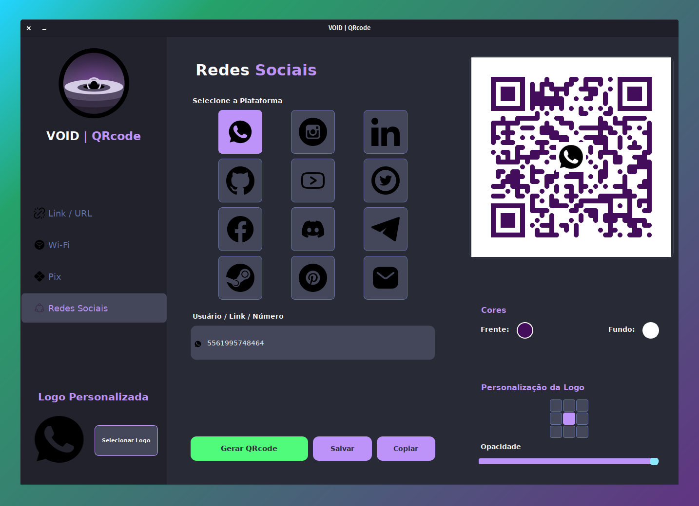

<div align="center">

[](#)
[](https://www.gnu.org/licenses/gpl-3.0)
[](https://www.python.org/)
[](https://github.com/AndreBFarias/QR-Code-Void-Generator/stargazers) [](https://github.com/AndreBFarias/QR-Code-Void-Generator/issues) <div align="center">
<div style="text-align: center;">
  <h1 style="font-size: 2.2em;">VOID | <span style="color:#bd93f9;">QRcode</span></h1>
  
</div>
</div></div>

### Descrição
Uma ferramenta elegante e poderosa para geração de QR Codes, projetada com foco em estética e funcionalidade. O **VOID | QRcode** permite criar códigos QR personalizados para diversos fins, desde links simples até pagamentos Pix e conexões Wi-Fi, tudo envolto em uma interface moderna e intuitiva.

### Funcionalidades

O grimório principal é invocado com `python3 main.py`, abrindo o Altar de Criação (GUI).

> #### A Interface Principal
> 

O gerador oferece os seguintes rituais de criação:

1.  **Link / URL:**
    * Gere códigos para websites, portfólios ou qualquer endereço web.

2.  **Wi-Fi:**
    * Crie códigos para facilitar a conexão em redes sem fio.
    * Suporte a segurança WPA/WPA2, WEP e redes abertas.
    * Opção para redes ocultas.

3.  **Pix (Pagamento Instantâneo):**
    * Gere QR Codes estáticos para recebimento de pagamentos Pix.
    * Preencha Chave, Nome, Cidade, Valor (opcional) e ID da Transação.

4.  **Redes Sociais:**
    * Modelos prontos para: Email, WhatsApp, Instagram, Twitter, Facebook, LinkedIn, GitHub, YouTube, Discord, Telegram, Steam e Pinterest.
    * Formatação automática de links e payloads (ex: `MATMSG` para emails no Android).

5.  **Personalização Visual:**
    * **Cores:** Escolha cores personalizadas para o QR Code (Frente) e o Fundo.
    * **Logo:** Insira sua própria logo no centro do QR Code. O sistema ajusta automaticamente o fundo da logo para uma integração perfeita.
    * **Formatos de Saída:** Salve suas criações em **PNG**, **JPG**, **PDF** ou **SVG**.

### Instalação (Linux - Debian/Ubuntu)

1.  **Clone o Repositório:**
    ```bash
    git clone https://github.com/AndreBFarias/QR-Code-Void-Generator.git
    cd QR-Code-Void-Generator
    ```
2.  **Execute o Ritual de Consagração:**
    ```bash
    chmod +x install.sh
    ./install.sh
    ```
    *(Este script instalará dependências do sistema, criará um ambiente virtual `venv`, instalará pacotes Python, e adicionará um lançador ao seu menu de aplicativos.)*

### Uso

* **Via Menu de Aplicativos:** Procure por "VOID | QRcode".
* **Manualmente (Terminal):**
    ```bash
    cd /caminho/para/QR-Code-Void-Generator
    source venv/bin/activate
    python3 main.py
    ```

### Desinstalação

Navegue até a pasta do projeto e execute o Ritual de Banimento:
```bash
chmod +x uninstall.sh
./uninstall.sh
```
*(Este script removerá o ambiente virtual, o ícone e o lançador do menu.)*

### Dependências

*   **Python 3.10+**
*   **PyQt6** (Interface Gráfica)
*   **Pillow** (Processamento de Imagem)
*   **qrcode** (Geração dos Códigos)

### Licença
Este projeto está sob a licença GPLv3. Livre para usar, modificar e distribuir, desde que a liberdade seja mantida.
